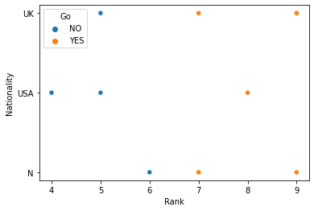

```python
# Data Analysis
import pandas as pd
#Read the csv file
df = pd.read_csv("C:/Users/itzan/Desktop/CVS files/comedy_show.csv")
```


```python
#top 5 rows printing of dataset
df.head()
```


<div>
<style scoped>
    .dataframe tbody tr th:only-of-type {
        vertical-align: middle;
    }

    .dataframe tbody tr th {
        vertical-align: top;
    }

    .dataframe thead th {
        text-align: right;
    }
</style>
<table border="1" class="dataframe">
  <thead>
    <tr style="text-align: right;">
      <th></th>
      <th>Age</th>
      <th>Experience</th>
      <th>Rank</th>
      <th>TPR</th>
      <th>RTP</th>
      <th>Nationality</th>
      <th>Country</th>
      <th>Go</th>
    </tr>
  </thead>
  <tbody>
    <tr>
      <th>0</th>
      <td>36</td>
      <td>10</td>
      <td>9</td>
      <td>1.2</td>
      <td>5.6</td>
      <td>UK</td>
      <td>America</td>
      <td>NO</td>
    </tr>
    <tr>
      <th>1</th>
      <td>42</td>
      <td>12</td>
      <td>4</td>
      <td>2.5</td>
      <td>6.1</td>
      <td>USA</td>
      <td>India</td>
      <td>NO</td>
    </tr>
    <tr>
      <th>2</th>
      <td>23</td>
      <td>4</td>
      <td>6</td>
      <td>4.5</td>
      <td>4.8</td>
      <td>N</td>
      <td>China</td>
      <td>NO</td>
    </tr>
    <tr>
      <th>3</th>
      <td>52</td>
      <td>4</td>
      <td>4</td>
      <td>8.8</td>
      <td>7.7</td>
      <td>USA</td>
      <td>Austria</td>
      <td>NO</td>
    </tr>
    <tr>
      <th>4</th>
      <td>43</td>
      <td>21</td>
      <td>8</td>
      <td>4.1</td>
      <td>4.8</td>
      <td>USA</td>
      <td>Bhutan</td>
      <td>YES</td>
    </tr>
  </tbody>
</table>
</div>


```python
#bottom 5 rows printing
df.tail()
```


<div>
<style scoped>
    .dataframe tbody tr th:only-of-type {
        vertical-align: middle;
    }

    .dataframe tbody tr th {
        vertical-align: top;
    }

    .dataframe thead th {
        text-align: right;
    }
</style>
<table border="1" class="dataframe">
  <thead>
    <tr style="text-align: right;">
      <th></th>
      <th>Age</th>
      <th>Experience</th>
      <th>Rank</th>
      <th>TPR</th>
      <th>RTP</th>
      <th>Nationality</th>
      <th>Country</th>
      <th>Go</th>
    </tr>
  </thead>
  <tbody>
    <tr>
      <th>8</th>
      <td>52</td>
      <td>13</td>
      <td>7</td>
      <td>9.5</td>
      <td>2.7</td>
      <td>N</td>
      <td>Nepal</td>
      <td>YES</td>
    </tr>
    <tr>
      <th>9</th>
      <td>35</td>
      <td>5</td>
      <td>9</td>
      <td>4.6</td>
      <td>1.6</td>
      <td>N</td>
      <td>Russia</td>
      <td>YES</td>
    </tr>
    <tr>
      <th>10</th>
      <td>24</td>
      <td>3</td>
      <td>5</td>
      <td>7.5</td>
      <td>1.2</td>
      <td>USA</td>
      <td>Africa</td>
      <td>NO</td>
    </tr>
    <tr>
      <th>11</th>
      <td>18</td>
      <td>3</td>
      <td>7</td>
      <td>4.1</td>
      <td>6.3</td>
      <td>UK</td>
      <td>North korea</td>
      <td>YES</td>
    </tr>
    <tr>
      <th>12</th>
      <td>45</td>
      <td>9</td>
      <td>9</td>
      <td>9.7</td>
      <td>5.8</td>
      <td>UK</td>
      <td>South Korea</td>
      <td>YES</td>
    </tr>
  </tbody>
</table>
</div>


```python
#for printing complete dataset
df
```


<div>
<style scoped>
    .dataframe tbody tr th:only-of-type {
        vertical-align: middle;
    }

    .dataframe tbody tr th {
        vertical-align: top;
    }

    .dataframe thead th {
        text-align: right;
    }
</style>
<table border="1" class="dataframe">
  <thead>
    <tr style="text-align: right;">
      <th></th>
      <th>Age</th>
      <th>Experience</th>
      <th>Rank</th>
      <th>TPR</th>
      <th>RTP</th>
      <th>Nationality</th>
      <th>Country</th>
      <th>Go</th>
    </tr>
  </thead>
  <tbody>
    <tr>
      <th>0</th>
      <td>36</td>
      <td>10</td>
      <td>9</td>
      <td>1.2</td>
      <td>5.6</td>
      <td>UK</td>
      <td>America</td>
      <td>NO</td>
    </tr>
    <tr>
      <th>1</th>
      <td>42</td>
      <td>12</td>
      <td>4</td>
      <td>2.5</td>
      <td>6.1</td>
      <td>USA</td>
      <td>India</td>
      <td>NO</td>
    </tr>
    <tr>
      <th>2</th>
      <td>23</td>
      <td>4</td>
      <td>6</td>
      <td>4.5</td>
      <td>4.8</td>
      <td>N</td>
      <td>China</td>
      <td>NO</td>
    </tr>
    <tr>
      <th>3</th>
      <td>52</td>
      <td>4</td>
      <td>4</td>
      <td>8.8</td>
      <td>7.7</td>
      <td>USA</td>
      <td>Austria</td>
      <td>NO</td>
    </tr>
    <tr>
      <th>4</th>
      <td>43</td>
      <td>21</td>
      <td>8</td>
      <td>4.1</td>
      <td>4.8</td>
      <td>USA</td>
      <td>Bhutan</td>
      <td>YES</td>
    </tr>
    <tr>
      <th>5</th>
      <td>44</td>
      <td>14</td>
      <td>5</td>
      <td>1.5</td>
      <td>3.4</td>
      <td>UK</td>
      <td>Dubai</td>
      <td>NO</td>
    </tr>
    <tr>
      <th>6</th>
      <td>66</td>
      <td>3</td>
      <td>7</td>
      <td>2.9</td>
      <td>6.9</td>
      <td>N</td>
      <td>Paris</td>
      <td>YES</td>
    </tr>
    <tr>
      <th>7</th>
      <td>35</td>
      <td>14</td>
      <td>9</td>
      <td>9.8</td>
      <td>1.4</td>
      <td>UK</td>
      <td>Germany</td>
      <td>YES</td>
    </tr>
    <tr>
      <th>8</th>
      <td>52</td>
      <td>13</td>
      <td>7</td>
      <td>9.5</td>
      <td>2.7</td>
      <td>N</td>
      <td>Nepal</td>
      <td>YES</td>
    </tr>
    <tr>
      <th>9</th>
      <td>35</td>
      <td>5</td>
      <td>9</td>
      <td>4.6</td>
      <td>1.6</td>
      <td>N</td>
      <td>Russia</td>
      <td>YES</td>
    </tr>
    <tr>
      <th>10</th>
      <td>24</td>
      <td>3</td>
      <td>5</td>
      <td>7.5</td>
      <td>1.2</td>
      <td>USA</td>
      <td>Africa</td>
      <td>NO</td>
    </tr>
    <tr>
      <th>11</th>
      <td>18</td>
      <td>3</td>
      <td>7</td>
      <td>4.1</td>
      <td>6.3</td>
      <td>UK</td>
      <td>North korea</td>
      <td>YES</td>
    </tr>
    <tr>
      <th>12</th>
      <td>45</td>
      <td>9</td>
      <td>9</td>
      <td>9.7</td>
      <td>5.8</td>
      <td>UK</td>
      <td>South Korea</td>
      <td>YES</td>
    </tr>
  </tbody>
</table>
</div>


```python
#to read more than 5 rows of dataset
df.head(10)
df.tail(10)
```


<div>
<style scoped>
    .dataframe tbody tr th:only-of-type {
        vertical-align: middle;
    }

    .dataframe tbody tr th {
        vertical-align: top;
    }

    .dataframe thead th {
        text-align: right;
    }
</style>
<table border="1" class="dataframe">
  <thead>
    <tr style="text-align: right;">
      <th></th>
      <th>Age</th>
      <th>Experience</th>
      <th>Rank</th>
      <th>TPR</th>
      <th>RTP</th>
      <th>Nationality</th>
      <th>Country</th>
      <th>Go</th>
    </tr>
  </thead>
  <tbody>
    <tr>
      <th>3</th>
      <td>52</td>
      <td>4</td>
      <td>4</td>
      <td>8.8</td>
      <td>7.7</td>
      <td>USA</td>
      <td>Austria</td>
      <td>NO</td>
    </tr>
    <tr>
      <th>4</th>
      <td>43</td>
      <td>21</td>
      <td>8</td>
      <td>4.1</td>
      <td>4.8</td>
      <td>USA</td>
      <td>Bhutan</td>
      <td>YES</td>
    </tr>
    <tr>
      <th>5</th>
      <td>44</td>
      <td>14</td>
      <td>5</td>
      <td>1.5</td>
      <td>3.4</td>
      <td>UK</td>
      <td>Dubai</td>
      <td>NO</td>
    </tr>
    <tr>
      <th>6</th>
      <td>66</td>
      <td>3</td>
      <td>7</td>
      <td>2.9</td>
      <td>6.9</td>
      <td>N</td>
      <td>Paris</td>
      <td>YES</td>
    </tr>
    <tr>
      <th>7</th>
      <td>35</td>
      <td>14</td>
      <td>9</td>
      <td>9.8</td>
      <td>1.4</td>
      <td>UK</td>
      <td>Germany</td>
      <td>YES</td>
    </tr>
    <tr>
      <th>8</th>
      <td>52</td>
      <td>13</td>
      <td>7</td>
      <td>9.5</td>
      <td>2.7</td>
      <td>N</td>
      <td>Nepal</td>
      <td>YES</td>
    </tr>
    <tr>
      <th>9</th>
      <td>35</td>
      <td>5</td>
      <td>9</td>
      <td>4.6</td>
      <td>1.6</td>
      <td>N</td>
      <td>Russia</td>
      <td>YES</td>
    </tr>
    <tr>
      <th>10</th>
      <td>24</td>
      <td>3</td>
      <td>5</td>
      <td>7.5</td>
      <td>1.2</td>
      <td>USA</td>
      <td>Africa</td>
      <td>NO</td>
    </tr>
    <tr>
      <th>11</th>
      <td>18</td>
      <td>3</td>
      <td>7</td>
      <td>4.1</td>
      <td>6.3</td>
      <td>UK</td>
      <td>North korea</td>
      <td>YES</td>
    </tr>
    <tr>
      <th>12</th>
      <td>45</td>
      <td>9</td>
      <td>9</td>
      <td>9.7</td>
      <td>5.8</td>
      <td>UK</td>
      <td>South Korea</td>
      <td>YES</td>
    </tr>
  </tbody>
</table>
</div>


```python
#get the information of the dataset
#shape parameter
df.shape
```


    (13, 8)


```python
#to get the information of datatype we will use info
df.info()
```

    <class 'pandas.core.frame.DataFrame'>
    RangeIndex: 13 entries, 0 to 12
    Data columns (total 8 columns):
     #   Column       Non-Null Count  Dtype  
    ---  ------       --------------  -----  
     0   Age          13 non-null     int64  
     1   Experience   13 non-null     int64  
     2   Rank         13 non-null     int64  
     3   TPR          13 non-null     float64
     4   RTP          13 non-null     float64
     5   Nationality  13 non-null     object 
     6   Country      13 non-null     object 
     7   Go           13 non-null     object 
    dtypes: float64(2), int64(3), object(3)
    memory usage: 960.0+ bytes
    


```python
#Data cleaning-new topic
#for calculating mean,median,mode
df.describe()
```


<div>
<style scoped>
    .dataframe tbody tr th:only-of-type {
        vertical-align: middle;
    }

    .dataframe tbody tr th {
        vertical-align: top;
    }

    .dataframe thead th {
        text-align: right;
    }
</style>
<table border="1" class="dataframe">
  <thead>
    <tr style="text-align: right;">
      <th></th>
      <th>Age</th>
      <th>Experience</th>
      <th>Rank</th>
      <th>TPR</th>
      <th>RTP</th>
    </tr>
  </thead>
  <tbody>
    <tr>
      <th>count</th>
      <td>13.000000</td>
      <td>13.000000</td>
      <td>13.000000</td>
      <td>13.000000</td>
      <td>13.000000</td>
    </tr>
    <tr>
      <th>mean</th>
      <td>39.615385</td>
      <td>8.846154</td>
      <td>6.846154</td>
      <td>5.438462</td>
      <td>4.484615</td>
    </tr>
    <tr>
      <th>std</th>
      <td>13.263600</td>
      <td>5.727800</td>
      <td>1.908147</td>
      <td>3.200921</td>
      <td>2.202970</td>
    </tr>
    <tr>
      <th>min</th>
      <td>18.000000</td>
      <td>3.000000</td>
      <td>4.000000</td>
      <td>1.200000</td>
      <td>1.200000</td>
    </tr>
    <tr>
      <th>25%</th>
      <td>35.000000</td>
      <td>4.000000</td>
      <td>5.000000</td>
      <td>2.900000</td>
      <td>2.700000</td>
    </tr>
    <tr>
      <th>50%</th>
      <td>42.000000</td>
      <td>9.000000</td>
      <td>7.000000</td>
      <td>4.500000</td>
      <td>4.800000</td>
    </tr>
    <tr>
      <th>75%</th>
      <td>45.000000</td>
      <td>13.000000</td>
      <td>9.000000</td>
      <td>8.800000</td>
      <td>6.100000</td>
    </tr>
    <tr>
      <th>max</th>
      <td>66.000000</td>
      <td>21.000000</td>
      <td>9.000000</td>
      <td>9.800000</td>
      <td>7.700000</td>
    </tr>
  </tbody>
</table>
</div>


```python
#Check Missing values
#to check whether their is null value in data or not
df.isnull().sum()
```


    Age            0
    Experience     0
    Rank           0
    TPR            0
    RTP            0
    Nationality    0
    Country        0
    Go             0
    dtype: int64


```python
#to remove duplicate value in data
data=df.drop_duplicates(subset="Go")
data
```


<div>
<style scoped>
    .dataframe tbody tr th:only-of-type {
        vertical-align: middle;
    }

    .dataframe tbody tr th {
        vertical-align: top;
    }

    .dataframe thead th {
        text-align: right;
    }
</style>
<table border="1" class="dataframe">
  <thead>
    <tr style="text-align: right;">
      <th></th>
      <th>Age</th>
      <th>Experience</th>
      <th>Rank</th>
      <th>TPR</th>
      <th>RTP</th>
      <th>Nationality</th>
      <th>Country</th>
      <th>Go</th>
    </tr>
  </thead>
  <tbody>
    <tr>
      <th>0</th>
      <td>36</td>
      <td>10</td>
      <td>9</td>
      <td>1.2</td>
      <td>5.6</td>
      <td>UK</td>
      <td>America</td>
      <td>NO</td>
    </tr>
    <tr>
      <th>4</th>
      <td>43</td>
      <td>21</td>
      <td>8</td>
      <td>4.1</td>
      <td>4.8</td>
      <td>USA</td>
      <td>Bhutan</td>
      <td>YES</td>
    </tr>
  </tbody>
</table>
</div>


```python
#function returns a series containing count of unique values
df.value_counts("Go")
```


    Go
    YES    7
    NO     6
    dtype: int64


```python
#NEW TOPIC-DATA VISUALIZATION
#importing library files
import seaborn as sns
import matplotlib.pyplot as plt
#for displaying the output
sns.countplot(x="Go",data=df)
plt.show()
```


    

    


```python
#TO SHOW SCATTERPLOT of Go
sns.scatterplot(x="Experience",y="Rank",hue="Go",data=df)
plt.show()
```


    

    


```python
#TO SHOW SCATTERPLOT of Petal
sns.scatterplot(x="Rank",y="Nationality",hue="Go",data=df)
plt.show()
```


    

    


```python
#Pairplot
#this is the parameter for color encoading
sns.pairplot(df.drop(['Age'],axis=1),hue="Go",height=3)
plt.show()
```


    

    


```python
#Histogram
fig, axes=plt.subplots(2,2,figsize=(10,10))

axes[0,0].set_title("Rank")
axes[0,0].hist(df["Nationality"], bins=10)

axes[0,1].set_title("Experience")
axes[0,1].hist(df["Nationality"], bins=10)

```


    (array([5., 0., 0., 0., 0., 4., 0., 0., 0., 4.]),
     array([0. , 0.2, 0.4, 0.6, 0.8, 1. , 1.2, 1.4, 1.6, 1.8, 2. ]),
     <BarContainer object of 10 artists>)


    

    


```python
#Histogram with Distplot
import seaborn as sns
import matplotlib.pyplot as plt
#ignore warning
import warnings
warnings.filterwarnings("ignore")

plot = sns.FacetGrid(df,hue="Go")
plot.map(sns.distplot,"Rank").add_legend()

plot = sns.FacetGrid(df,hue="Go")
plot.map(sns.distplot,"Experience").add_legend()
```


    <seaborn.axisgrid.FacetGrid at 0x2cbb627bca0>


    

    


    

    


```python
#Correlation
df.corr(method='pearson')
```


<div>
<style scoped>
    .dataframe tbody tr th:only-of-type {
        vertical-align: middle;
    }

    .dataframe tbody tr th {
        vertical-align: top;
    }

    .dataframe thead th {
        text-align: right;
    }
</style>
<table border="1" class="dataframe">
  <thead>
    <tr style="text-align: right;">
      <th></th>
      <th>Age</th>
      <th>Experience</th>
      <th>Rank</th>
      <th>TPR</th>
      <th>RTP</th>
    </tr>
  </thead>
  <tbody>
    <tr>
      <th>Age</th>
      <td>1.000000</td>
      <td>0.216344</td>
      <td>-0.055215</td>
      <td>0.059851</td>
      <td>0.339453</td>
    </tr>
    <tr>
      <th>Experience</th>
      <td>0.216344</td>
      <td>1.000000</td>
      <td>0.218768</td>
      <td>-0.039194</td>
      <td>-0.198330</td>
    </tr>
    <tr>
      <th>Rank</th>
      <td>-0.055215</td>
      <td>0.218768</td>
      <td>1.000000</td>
      <td>0.125207</td>
      <td>-0.254361</td>
    </tr>
    <tr>
      <th>TPR</th>
      <td>0.059851</td>
      <td>-0.039194</td>
      <td>0.125207</td>
      <td>1.000000</td>
      <td>-0.273254</td>
    </tr>
    <tr>
      <th>RTP</th>
      <td>0.339453</td>
      <td>-0.198330</td>
      <td>-0.254361</td>
      <td>-0.273254</td>
      <td>1.000000</td>
    </tr>
  </tbody>
</table>
</div>


```python
#Droping Age colum as it is of no use in classifing the class labels..

df.drop(["Age"],axis=1,inplace=True)
```

# Comedy data analysis using Decision Tree


```python
#Now try to create a model to solve our task
#As per our analysis 

'''Importing few library for create Decision tree Classifier and Visualising the tree structure'''
from sklearn import tree
from sklearn.tree import DecisionTreeClassifier
from sklearn.model_selection import train_test_split, cross_val_score

#here we separating independent variable or target variable from dataset


x = df[["Experience","Rank","TPR","RTP"]]
y = df["Go"]
#Before training the model we have split our data 
Xtrain, Xtest, Ytrain, Ytest = train_test_split(x,y, test_size=0.30,random_state=42)
#Spiliting data into validation train and validation test
Xt,Xcv,Yt,Ycv = train_test_split(Xtrain, Ytrain, test_size=0.10, random_state=42)

'''Now we have create a Decision tree classifier and trained it with training dataset'''

comedy_show_clf = DecisionTreeClassifier(criterion="gini",min_samples_split=2)
comedy_show_clf.fit(Xt,Yt)

#Visualised the tree which is formed on train dataset

tree.plot_tree(comedy_show_clf)
```


    [Text(167.4, 163.07999999999998, 'X[1] <= 6.5\ngini = 0.5\nsamples = 8\nvalue = [4, 4]'),
     Text(83.7, 54.360000000000014, 'gini = 0.0\nsamples = 4\nvalue = [4, 0]'),
     Text(251.10000000000002, 54.360000000000014, 'gini = 0.0\nsamples = 4\nvalue = [0, 4]')]


    

    


```python
#As our model has been trained...
#Now we can validate our decision tree using cross validation method to get the accuracy or performance score of our model

print("Accuracy score is:",cross_val_score(comedy_show_clf, Xt,Yt,cv=3,scoring="accuracy").mean())
```

    Accuracy score is: 0.7777777777777777
    


```python

```
